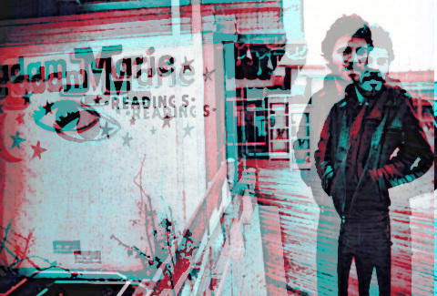

<h1>Fortune Teller Tarot Reader</h1>

<h3>Script to scrape all tarot card data from 'biddytarot.com' and use for reading tarot spreads</h3>

Takes major and minor arcana card data, including:

  1. upright keywords
  2. reversed keywords 
  3. overall card description 
  4. upright meaning 
  5. reversed meaning

 
78 card deck descriptions are based on imagery from the <i>Rider-Waite deck.</i>  
There are 22 major arcana cards and 56 minor arcana cards.  
There is one extra face card compared to normal 52 card decks (the page card). 
 
Minor card suits include: 

1. Cups
2. Swords
3. Pentacles
4. Wands

Each suit includes: ace, 2, 3, 4, 5, 6, 7, 8, 9, 10, page, knight, queen, and king

